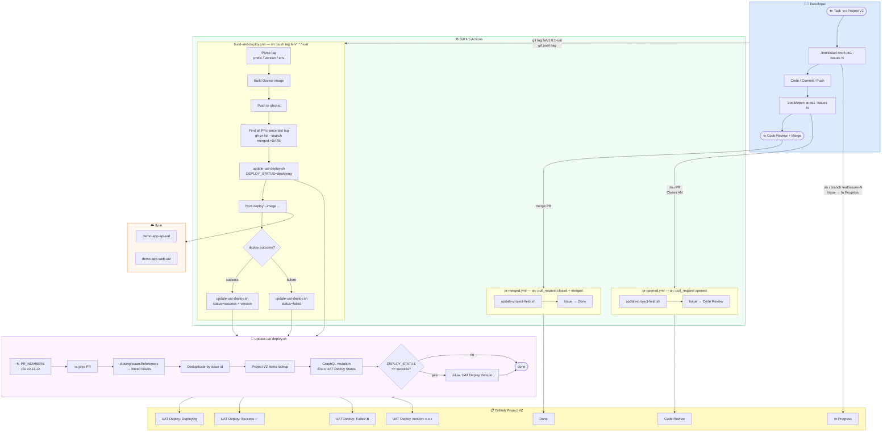

# GitHub Workflow System — Flow Diagram

```mermaid
flowchart TD
    subgraph DEV["👨‍💻 Developer"]
        D1([รับ Task จาก Project V2]) --> D2
        D2[".\tools\start-work.ps1 -Issues N"] --> D3
        D3[Code / Commit / Push] --> D4
        D4[".\tools\open-pr.ps1 -Issues N"] --> D5
        D5([รอ Code Review + Merge])
    end

    subgraph PV2["📋 GitHub Project V2"]
        P2[In Progress]
        P3[Code Review]
        P4[Done]
        P5["UAT Deploy: Deploying"]
        P6["UAT Deploy: Success ✅"]
        P7["UAT Deploy: Failed ❌"]
        P8["UAT Deploy Version: x.x.x"]
    end

    subgraph GHA["⚙️ GitHub Actions"]
        subgraph WF1["pr-opened.yml — on: pull_request opened"]
            A1[update-project-field.sh] --> A2[Issue → Code Review]
        end
        subgraph WF2["pr-merged.yml — on: pull_request closed + merged"]
            B1[update-project-field.sh] --> B2[Issue → Done]
        end
        subgraph WF3["build-and-deploy.yml — on: push tag fe/v*.*.*-uat"]
            C1[Parse tag\nprefix / version / env] --> C2
            C2[Build Docker image] --> C3
            C3[Push to ghcr.io] --> C4
            C4["Find all PRs since last tag\ngh pr list --search merged:>DATE"] --> C5
            C5[update-uat-deploy.sh\nDEPLOY_STATUS=deploying] --> C6
            C6[flyctl deploy --image ...] --> C7
            C7{deploy outcome?}
            C7 -->|success| C8[update-uat-deploy.sh\nstatus=success + version]
            C7 -->|failure| C9[update-uat-deploy.sh\nstatus=failed]
        end
    end

    subgraph SCRIPT["📜 update-uat-deploy.sh"]
        S1["รับ PR_NUMBERS\nเช่น 10,11,12"] --> S2
        S2[วนลูปทุก PR] --> S3
        S3["closingIssuesReferences\n→ linked issues"] --> S4
        S4[Deduplicate by issue id] --> S5
        S5[Project V2 items lookup] --> S6
        S6[GraphQL mutation\nอัปเดต UAT Deploy Status] --> S7
        S7{DEPLOY_STATUS\n== success?}
        S7 -->|yes| S8[อัปเดต UAT Deploy Version]
        S7 -->|no| S9([done])
        S8 --> S9
    end

    subgraph FLY["☁️ fly.io"]
        F1[demo-app-api-uat]
        F2[demo-app-web-uat]
    end

    D2 -->|"สร้าง branch feat/issues-N\nIssue → In Progress"| P2
    D4 -->|"สร้าง PR\nCloses #N"| WF1
    WF1 --> P3
    D5 -->|merge PR| WF2
    WF2 --> P4

    DEV -->|"git tag fe/v1.0.1-uat\ngit push tag"| WF3
    C5 --> SCRIPT
    C8 --> SCRIPT
    C9 --> SCRIPT
    SCRIPT --> P5
    SCRIPT --> P6
    SCRIPT --> P7
    SCRIPT --> P8
    C6 --> FLY

    style DEV fill:#dbeafe,stroke:#3b82f6
    style PV2 fill:#fef9c3,stroke:#eab308
    style GHA fill:#f0fdf4,stroke:#22c55e
    style SCRIPT fill:#fdf4ff,stroke:#a855f7
    style FLY fill:#fff7ed,stroke:#f97316
```
